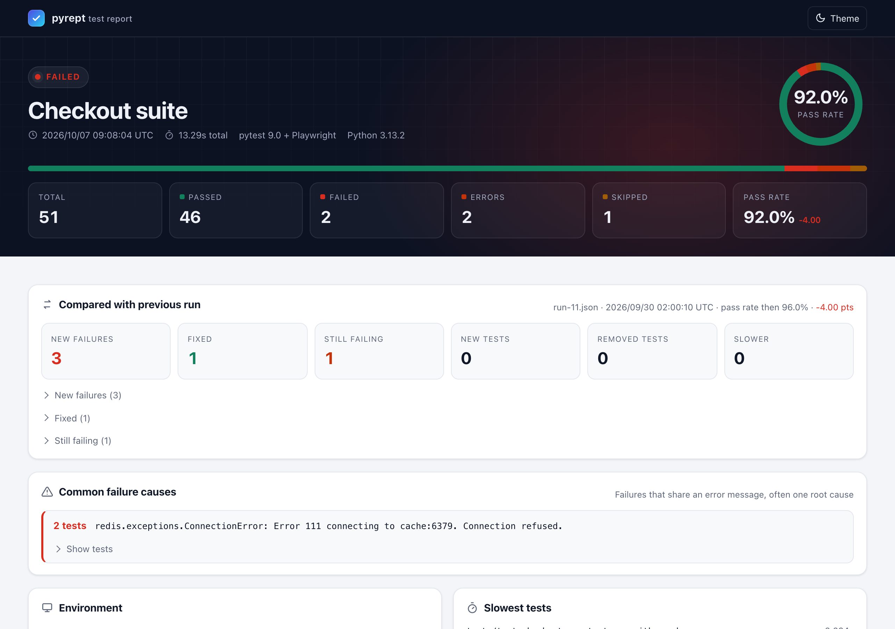
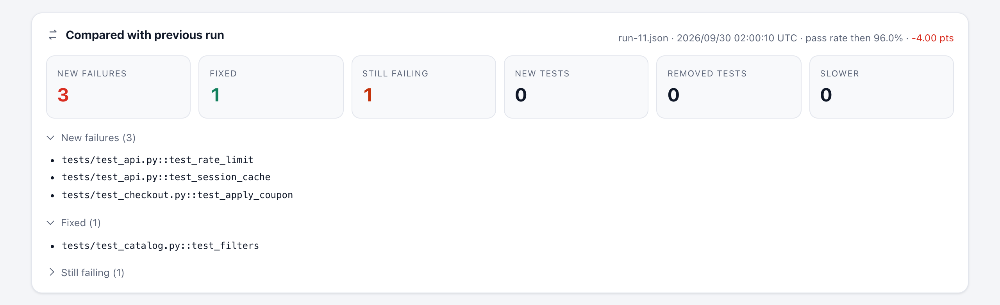
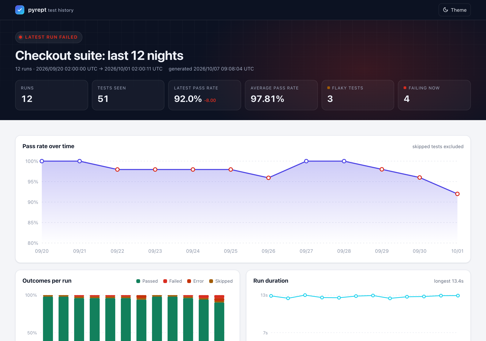

# pyrept

**One test report for every framework and every CI.** pyrept turns a test run into a self-contained HTML page, a JSON file for automation and, if you want, JUnit XML for your CI server. It shows what changed since the last run, and it can put the result straight into your GitHub job summary and pull request.

[See the live demo report](https://pankajnayak1994.github.io/pyrept/demo/report.html){ .md-button .md-button--primary } [Demo history page](https://pankajnayak1994.github.io/pyrept/demo/history.html){ .md-button }



## Quick start

```bash
pip install pyrept
pytest --pyrept
```

Open `report.html`. That's it. For unittest, nose2, behave or reports from other languages, see [Frameworks](frameworks.md) and [Converting reports](converters.md).

## What you get

- **One report shape across frameworks:** pytest (with xdist, reruns, subtests and pytest-bdd), unittest, nose2, behave and Playwright or Selenium browser tests.
- **Reports from any language:** convert JUnit XML, .NET TRX, NUnit, xUnit.net, Robot Framework, TAP, Allure, Cucumber JSON, Playwright Test JSON and pytest-json-report files.
- **What changed:** new failures, fixed tests, still-failing tests and slowdowns since the previous run, plus [trends and flaky tests](history.md) across many runs.
- **CI-native:** JUnit XML, [GitHub job summaries and PR comments](ci.md), quality gates (`--fail-under`, `--ignore-known-failures`) and Slack / Teams notifications.
- **Useful failure context:** captured output and logs, screenshots, browser console output, Playwright traces and videos, and failures grouped by root cause.
- **Nothing to host:** the HTML report is one offline file with search, filters, a test map, keyboard navigation and dark mode.

## The report at a glance



The comparison panel opens the report whenever you pass a baseline (`--pyrept-baseline=report.json`). **New failures** are listed first: those are the tests your change broke.



`pyrept history` turns the JSON reports of many runs into pass-rate trends, flaky tests and failure streaks.
